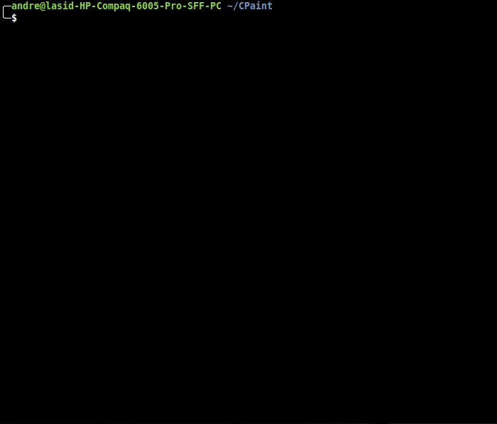

# CPaint

Software de primitivas gráficas feito em C.

### Compilação
Para compilar execute os scripts:
```bash
./gen_obj
./compile
```
e execute com `./cpaint`.

### Documentação
Para gerar documentação, utilize o (Doxygen)[http://www.doxygen.nl/index.html].
*Opcional*: mude o estilo da documentação com
```bash
cp *.css docs/html/.
```

# CPaint em ação
### Função `source`


## TODO
Funcionalidades (não)implementadas
* [x] Função help()     => mostra pequena documentação
* [x] Função list()     => lista conteudo do canvas
* [x] Função clear()    => limpa o canvas com a cor atual
* [x] Função image()    => redimensiona o canvas
* [x] Função color()    => muda cor do pincel
* [x] Função point()    => desenha um ponto
* [x] Função line()     => desenha uma linha
* [x] Função rect()     => desenha um retângulo
* [x] Função circle()   => desenha um círculo
* [x] Função poligon()  => desenha um polígono
* [x] Função fill()     => preenche um polígono com a cor atual
* [x] Função save()     => grava o arquivo de imagem em disco
* [x] Função open()     => abre um arquivo de imagem anterior
* [x] Função source()   => executa uma lista de comando de um arquivo externo

### Opcional
* [x] Interpretador de comandos
* [x] Criar documentação utilizando Doxygen
* [ ] Visualizar primitivas na tela após executar comando
* [x] Utilizar git
* [x] Utilizar valgrind
* [ ] Aumentar espessura da linha
* [ ] Copiar/recortar e colar (com escala)
* [ ] Desenhar primitivas mesmo que saa da tela (mudar verificação de limites para a função point)

---
*Projeto de ITP 2019.2*.  
*Professor Júlio César*.  
*Grupo: Andre Herman e Marcell Santana*
